<!--
  AUTO-GENERATED FILE — do not hand-edit.
  Source of truth: https://luke-angelo.com/resume.json (public/resume.json in the
  lukestrazz.github.io repo, served via GitHub Pages under Luke's custom
  domain). Update that file — this README regenerates itself via
  .github/workflows/update-readme.yml (scripts/generate-readme.mjs).
  Last generated: 2026-08-20
-->

### Software engineer building secure applications, modern interfaces, and production-ready systems — now bringing that full-stack and cloud delivery background to AI strategy and governance.

**IT Specialist (AI)** at **undefined**

- **Focus:** AI governance, secure systems, cloud delivery, full-stack
- **Trajectory:** Intern to team lead to federal AI specialist since 2023

 

## Tech I work with

**Platforms & Tools**

**Languages & Frameworks**

**AI & Automation**

**IDEs & Workflow**

 

## Experience

**Developer Team Lead** · Saberin Software Apr 2025 — Aug 2026

- Lead production development for .NET applications, reviewing code for quality, security, performance, and long-term maintainability.
- Designed and shipped AI-powered features using Azure OpenAI for both internal workflows and customer-facing experiences.
- Own Azure delivery across subscriptions, Entra ID, Azure AD B2C, app registrations, Blob Storage, and Data Factory resources.

Junior Software Developer · Saberin Software — Dec 2024 — Apr 2025

- Built and deployed cloud-hosted applications across Azure and AWS, including EC2, S3, IAM, CloudFront, and Azure storage services.
- Maintained YAML-based CI/CD pipelines in Azure DevOps and GitHub Actions to support repeatable deployments.
- Delivered application features across APIs, configuration, and debugging workflows while collaborating directly with stakeholders.

Entry Level Developer · Saberin Software — Aug 2023 — Dec 2024

- Used GitHub Copilot and AI agent workflows to accelerate implementation, documentation, and troubleshooting without lowering code quality.
- Contributed to React and .NET application work, API integrations, SQL-backed flows, and production issue resolution.
- Grew from task execution into feature ownership while balancing software delivery with a full academic schedule.

Software Developer Intern · Saberin Software — May 2023 — Aug 2023

- Entered the team through hands-on production work with a strong focus on debugging, secure development practices, and reliability.
- Built the foundation for the intern-to-team-lead progression by showing consistency, communication, and ownership early.
- Worked inside established engineering workflows using Git, Visual Studio, Jira, Confluence, and team documentation standards.

 

## Selected work

**StrazzTunedBuddy** — Open-source hardware · 105★ · [details](https://luke-angelo.com/projects/strazztunedbuddy/) · [repo](https://github.com/LukeStrazz/StrazzTunedBuddy)
An Arduino driving companion with procedurally drawn expressions on a 128x64 OLED — the most-starred and most-forked project on my GitHub.

**VitalVues** — OpenAI application · [details](https://luke-angelo.com/projects/vitalvues/) · [repo](https://github.com/LukeStrazz/VitalVues)
A senior capstone that explains bloodwork results in plain language, then builds diet and workout guidance from the user's own markers.

**WHIM** — Private · .NET 9 product · [details](https://luke-angelo.com/projects/whim/)
A clean-architecture .NET 9 solution with PostgreSQL, containerised services, and cross-platform mobile clients.

**Strazz Robinhood MCP** — Private · MCP server · [details](https://luke-angelo.com/projects/strazz-robinhood-mcp/)
A Model Context Protocol server exposing brokerage research and risk-managed, paper-trading-by-default execution to AI clients.

**Saberin Software** — Production delivery
Secure .NET delivery, AI integration, cloud identity work, team leadership, and shipping features that hold up in production.

 

## Education

**B.S. in Computer Science** — Farmingdale State College (Completed January 2025)
`3.65 GPA` `President's List 2023` `Dean's List 2023 – 2024`

 

## How I work

`Agile development` `Client communication` `Technical documentation` `Mentorship` `Cross-functional teamwork` `Production debugging`

 

Built from one shared data source — <a href="https://luke-angelo.com/resume.json">resume.json</a> — that also powers <a href="https://luke-angelo.com">luke-angelo.com</a>.

